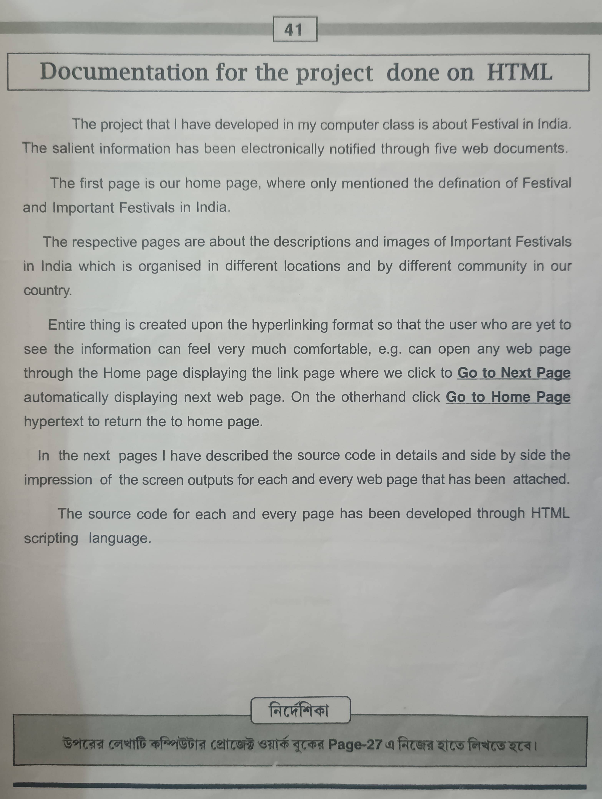

# Project Name

## Overview

This project includes a series of images showcasing various aspects of the website. Below is a sequential display of the images with their respective names.

## Images

1. **Front Page.jpeg**
   - 
   - Description: The front page of the website, highlighting the main interface.

2. **Introduction.jpeg**
   - 
   - Description: An introduction to the website, providing an overview of its features.

3. **Home Page.png**
   - 
   - Description: The home page layout of the website.

4. **Web Page-1.png**
   - 
   - Description: A detailed view of the first web page.

5. **Web Page-2.png**
   - 
   - Description: A detailed view of the second web page.

6. **Web Page-3.png**
   - 
   - Description: A detailed view of the third web page.

7. **Web Page-4.png**
   - 
   - Description: A detailed view of the fourth web page.

8. **Web Page-5.png**
   - 
   - Description: A detailed view of the fifth web page.

## Usage

Feel free to explore the images to get an idea of the design and layout of the website. Each image showcases different sections and pages of the site.

## License

This project is licensed under the [MIT License](LICENSE).

## Contact

For any inquiries, please contact [Your Name] at [Your Email].
